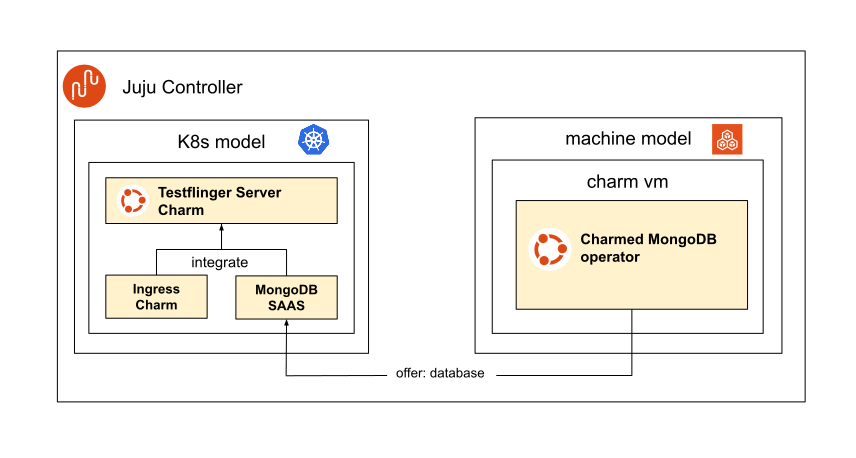

.. _architecture:

Architecture
============

Component overview
------------------

At a high level, Testflinger has three tiers: clients that submit and track
jobs, the server that holds the API and job queues, and an agent host where
agents poll their queues and run jobs against devices under test (DUTs).

 to the API.
   :align: center

The diagram above illustrates the flow of a job through the Testflinger system:

* Clients (the CLI, the ``submit`` GitHub action, or the Web UI) submit
  jobs to the server and track their results.
* Server exposes the REST API and holds the job queues.
* Agent host, a machine that runs several agents; each agent services one or more queues.
* Device connector provisions and operates a device on the agent's behalf.
* Device under test (DUT) is a physical machine that a job runs against.

When a job is submitted by a client, it targets a queue in the job definition, and is placed on that queue by the server. The agent that serves the queue continuously polls the queue status. Once the agent claims matching jobs, the agent executes the job's phases on the DUT through the device connector. The job results are then reported back to the server for the client to read.

Testflinger Server
------------------

The Testflinger server is a Kubernetes (K8s) application deployed using Juju.
As a backend, it uses a MongoDB database that stores all data related to
Testflinger, including job definitions, job results, agent information,
and more.

The preferred way to deploy MongoDB is to use the MongoDB machine charm,
which deploys a MongoDB instance on a virtual machine (VM). This can
improve performance and reduce resource complexity compared to deploying
MongoDB as a K8s application.

The following diagram illustrates the architecture of the Testflinger
server deployment:

In the above diagram, there is a single `Juju Controller <Juju Controller_>`_ 
that manages both the K8s and machine `Juju models <Juju Model_>`_. 
In the machine model, only the MongoDB charm is deployed, while in the K8s
model, the Testflinger server charm and the ingress charm are deployed.

To allow the Testflinger server to communicate with the MongoDB database we
need to set up a cross-model relation. This is achieved by offering the ``database``
endpoint from the machine model and consuming it in the K8s model as a SAAS 
application. The Testflinger server charm is then related with both
the ingress charm and the MongoDB SAAS via `Juju Integration <Juju Integration_>`_ 
to enable API access and database connectivity. For a more detailed guide
on how the cross-model relation is set up, please refer to the 
`Juju How to Manage offers guide <Juju Offers Guide_>`_.

.. _Juju Controller: https://documentation.ubuntu.com/juju/3.6/reference/controller/
.. _Juju Offers Guide: https://documentation.ubuntu.com/juju/3.6/howto/manage-offers/#manage-offers
.. _Juju Integration: https://documentation.ubuntu.com/juju/3.6/reference/relation/
.. _Juju Model: https://documentation.ubuntu.com/juju/3.6/reference/model/
