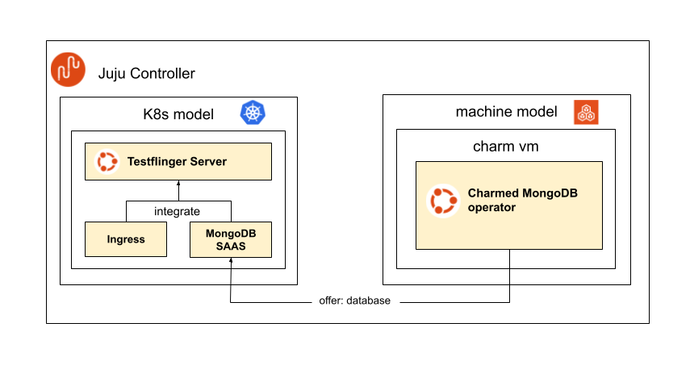

.. _howto-deploy-server:

Deploy a Testflinger Server
===========================

This guide outlines the steps to deploy a Testflinger server using Juju and
the Testflinger server charm from Charmhub.

Architecture
------------

The Testflinger server is a Kubernetes (K8s) application deployed using Juju.
As a backend, it uses a MongoDB database that stores all data related to
Testflinger, including job definitions, job results, agent information,
and more.

The preferred way to deploy MongoDB is to use the MongoDB machine charm,
which deploys a MongoDB instance on a virtual machine (VM). This can
improve performance and reduce resource complexity compared to deploying
MongoDB as a K8s application.

The following diagram illustrates the architecture of the Testflinger
server deployment:

Prerequisites
-------------

The following prerequisites cover the necessary steps to set up K8s and
machine-based Juju environments required for the Testflinger server
deployment. For a detailed guide on how to set up Juju, refer to the
`official Juju documentation <https://documentation.ubuntu.com/juju/>`_.

Dependencies
^^^^^^^^^^^^

Install the following dependencies:

.. code-block:: shell

  $ sudo apt-get install git
  $ sudo snap install juju lxd
  $ sudo snap install microk8s --channel 1.32-strict
  $ sudo snap install terraform --classic

.. note::

  Juju requires the strict version of the ``microk8s`` snap to be installed.

LXD
^^^

Make sure LXD is initialized.

.. code-block:: shell

  $ lxd init --auto

.. note::

  Feel free to initialize LXD with a configuration that suits your needs.

MicroK8s
^^^^^^^^

The Testflinger server deployment depends on the following MicroK8s setup.

.. code-block:: shell

  $ sudo snap alias microk8s.kubectl kubectl
  $ sudo usermod -aG snap_microk8s ubuntu
  $ newgrp snap_microk8s  # or reboot
  $ microk8s status --wait-ready
  $ sudo microk8s enable dns hostpath-storage ingress

Juju
^^^^

Set up the Juju controllers needed for the Testflinger server deployment.

.. code-block:: shell

  # Workaround to get localhost-controller to connect to microk8s
  $ server_url=$(microk8s config | grep server | awk '{print $2;}')
  $ sed -i "s|server: .*|server: $server_url|g" \
      /var/snap/microk8s/current/credentials/client.config
  $ juju bootstrap microk8s microk8s-controller
  $ juju bootstrap localhost localhost-controller
  $ juju add-cloud microk8s --controller localhost-controller

Then create the models for the server and database deployments.

.. code-block:: shell

  $ juju add-model testflinger-db localhost
  $ juju add-model testflinger microk8s

MongoDB deployment
------------------

Deploy the MongoDB charm into the ``testflinger-db`` model.

.. code-block:: shell

  $ juju deploy mongodb --channel 6/stable -m testflinger-db

Once the deployment is complete, offer the MongoDB endpoint so that it can
be consumed by the Testflinger server application in the K8s model.

.. code-block:: shell

  $ juju offer testflinger-db.mongodb:database mongodb

Testflinger server deployment
------------------------------

.. tip::

  The following steps assume you are located in the k8s model, otherwise you can
  switch by running ``juju switch testflinger``.

Juju CLI
^^^^^^^^

The following steps outline how to deploy the Testflinger server charm
using the Juju CLI.

First, consume the MongoDB endpoint offered in the previous step.

.. code-block:: shell

  $ juju consume localhost:admin/testflinger-db.mongodb

Deploy the Testflinger server charm.

.. code-block:: shell

  $ juju deploy testflinger-k8s --channel stable \
      --config jwt_signing_key="<signing-key>"

.. note::

  The ``jwt_signing_key`` configuration is required for authenticating
  API requests to the Testflinger server. You should generate a secure
  random string to use as the signing key.

.. note::

  You can also pass the ``-n <units>`` flag to deploy multiple units of the
  Testflinger server application. Adjust this number based on your needs
  and the resources available in your cluster.

Relate the Testflinger server application with the MongoDB endpoint.

.. code-block:: shell

  $ juju integrate testflinger-k8s mongodb

Monitor the deployment progress until all units are active.

.. code-block:: shell

  $ juju status --storage --relations --watch 5s

Once all units are active, deploy and configure the ingress charm to
expose the Testflinger server API.

.. code-block:: shell

  $ juju deploy nginx-ingress-integrator --trust
  $ juju integrate nginx-ingress-integrator testflinger-k8s
  $ juju config testflinger-k8s external-hostname=testflinger.local

The deployment finishes when the status shows ``Ingress IP(s): 127.0.0.1``
on ``nginx-ingress-integrator``. The IP addresses may differ based on your
Kubernetes cluster setup.

.. important::

  The above ingress deployment steps are intended for testing and
  development purposes. For production deployments, it is recommended to
  use TLS for secure communication. For more information on how to set
  up TLS, refer to the
  `NGINX Ingress Integrator charm documentation <nginx-ingress-tls_>`_.

Terraform
^^^^^^^^^

Testflinger also provides a Terraform module that automates the deployment
of the Testflinger server. The module is located in the
`server/terraform/ <testflinger-terraform_>`_ directory of the Testflinger
repository.

Variables
~~~~~~~~~

Create a ``terraform.tfvars`` file and define the following variables.

.. code-block:: text

  jwt_signing_key                = "(sensitive value)"
  external_hostname              = "testflinger.local"

.. note::

  Refer to ``server/terraform/variables.tf`` and
  ``server/terraform/README.md`` for the full list of available variables
  and their descriptions.

Apply the Terraform plan
~~~~~~~~~~~~~~~~~~~~~~~~

Initialize Terraform and apply the plan.

.. code-block:: shell

  $ terraform init
  $ terraform apply  # optionally run 'terraform plan' first

Wait for the Juju units to finish their setup.

.. code-block:: shell

  $ juju status --storage --relations --watch 5s

Networking
----------

Ensure that your system can resolve and reach the ``external_hostname``
configured earlier. For local testing, edit ``/etc/hosts`` to define
the name resolution.

.. code-block:: text

  127.0.0.1  testflinger.local

Testflinger CLI
---------------

Testflinger CLI defaults to using ``testflinger.canonical.com`` as its
Testflinger server. To override the server being used, pass the
``--server`` flag or edit the ``testflinger-cli.conf`` configuration file.

First, install Testflinger CLI.

.. code-block:: shell

  $ sudo snap install testflinger-cli

Then connect to the server.

.. code-block:: shell

  $ testflinger-cli --server http://testflinger.local list-agents

The CLI should not error out, though the list of agents may be empty.

Refer to the :doc:`/reference/cli-config` reference for details on
configuring the CLI.
